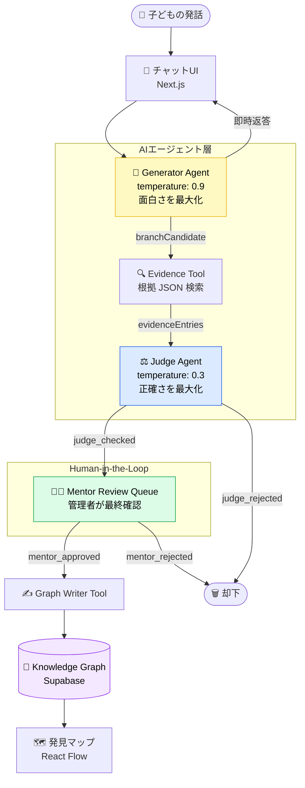

# 子どもの「横道の問い」を知識資産に変えるAI ― BRANCH LEARNING をバイブコーディングで作った話

## 1. はじめに

はじめまして。まめ大福と申します。
普段は美容皮膚科で看護師をしています。おもしろいお医者さんの下で働いており、ひょんなことからバイブコーディングをはじめました。普段は業務改善アプリを作っています。
開発を始めてまだ1年くらいです。

## 2. 今回の開発の目的

キッズプログラミング教室の運営にも関わっているのですが、ふとした瞬間に気になることがありました。

子どもの質問に対して、その日の学習内容と違った時「それはまた今度やるから今はこっちやろっか！」といって流してしまうことが多いなと思いました。せっかく興味持ってくれたのにもったいないことしたなと。

その「横道の問い」をちゃんと受け止めてくれるAIがいれば、子どもの好奇心を逃さなくて済むんじゃないか。そう思ってBRANCH LEARNINGを作りました。

## 3. BRANCH LEARNING でできること

https://youtu.be/OY9HsD0UmOY

### 今日やることを自分で選ぶ


教科を選ぶと、先生キャラが「今日は何をやる？」と話しかけてきます。そのまま単元カードがチャットの中にぽこっと出てくる仕組みです。

「漢字」「読み物・文学」「言葉の意味」「作文・表現」「自由に聞きたい」の中から選べます（教科によってカードの内容が変わります）。

はじめは生徒に自由に喋ってもらおうかと思っていたのですが、何を聞いたらわからない子もいるから選択のほうが学習意欲を削がないのではないかと考えて単元カードに変更しました。先生が口頭で聞いてくれる方が、アプリとして自然だし会話っぽくて良いなと。

### 子どもの「横道」を逃さない


チャット画面はシンプルな LINE 風 UI です。テキスト入力でもマイクでも話しかけられます。スマホ・タブレット対応のレスポンシブデザインなので、子どもが普段使っているデバイスでそのままブラウザから使えますし、わからないことが出てきた時もわざわざパソコンを開かなくてもいいので手軽です。またアプリのインストールも不要です。（この画像はスマホで表示した時）

たとえば理科の授業中にこんな会話が生まれます。

> 子ども：光が水に入ると曲がるのはなんで？
>
> 先生（AI）：光は空気と水で進む速さが違うから、境目でぐにっと曲がるんだよ。これを「屈折」っていうんだ！
>
> 🌿 よりみち発見！ ところで、なんで虹が7色に見えるか知ってる？実は光の屈折と同じしくみで、雨つぶがプリズムみたいに光を分けてるんだよ！

先生の回答と同時に「横道」がポップアップします。本筋（屈折の説明）はちゃんと答えながら、子どもが気づいていない知識の広がりを自動で提示します。

### 写真で宿題のヒントをもらう


📷 ボタンを押すとカメラが起動し、宿題の写真を撮ると AI が問題を読み取ります。ポイントは**答えは絶対に言わないこと**。「この問題はこういう考え方をするといいよ」というヒントだけを学年に合わせた言葉で返します。

### 表情で先生が気づいてくれる


顔認識カメラをオンにすると、困り顔・悲しそうな表情が続いたとき先生が自動で「難しかった？もっとわかりやすく説明しようか？」と声をかけます。普通の授業って先生が子供の表情見ながらやってるのでできるだけそれに寄せられるようにしました。ブラウザ完結（カメラ映像はサーバーに送らない）なのでプライバシーも安心です。

### 発見マップで知識がつながる


管理者（メンター）がブランチを承認すると、React Flow で描いた「発見マップ」に追加されます。教科を中心に横道がどんどん枝分かれしていく様子が可視化されます。

---

## 4. アーキテクチャ：なぜ2つの Agent に分けたか




Generator と Judge を別エージェントにした理由は、**最適化目標が意図的に対立しているから**です。

Generator は temperature: 0.9 で「面白い横道を見つけること」に全振りします。一方 Judge は temperature: 0.3 で「事実として正しいか・学年に合っているか」を厳しく審査します。単一エージェントにすると、面白さと正確さが中途半端に折衷されてしまいます。

また、子どもへの即時提示と教室の知識資産への保存を意図的に分離しています。Generator の返答は先に子どもへ届き、Judge の審査が通ったブランチだけが Supabase に保存されます。メンターが承認した分だけが発見マップに反映されます。

### 技術スタック

| 役割           | 技術                                 |
| -------------- | ------------------------------------ |
| フロントエンド | Next.js 16.2.4 (App Router)          |
| LLM            | Azure OpenAI gpt-4o-mini             |
| 音声合成       | Azure TTS (SSML、キャラ別音声)       |
| 顔認識         | @vladmandic/face-api（ブラウザ完結） |
| グラフ可視化   | @xyflow/react (React Flow)           |
| ストレージ     | Supabase (PostgreSQL)                |
| ホスティング   | Azure Container Apps                 |
| CI/CD          | GitHub Actions                       |

---

## 5. 実装でハマったこと

### iOS で音声が出ない問題

一番時間を溶かしました。iOS Safari はユーザーのジェスチャーをトリガーにしないと音声が再生できないという制約があります。

最初は `new Audio()` を毎回作成する方式を試しましたが、マイクボタンを押した後に async 処理を挟むと iOS がジェスチャーと音声再生を別物と判断してブロックします。

解決策はアンロック用とスピーカー用で `<audio>` 要素を完全に分離することでした。マイクボタンを押した瞬間に無音の WAV をアンロック用要素で再生し、iOS の制約を突破してから実際の TTS を再生する要素に切り替えます。

```ts
const SILENT_WAV = "data:audio/wav;base64,UklGRiQAAABXQVZFZm10IBAAAA...";

// マイクボタン押下時
function startRecording() {
  stopAudio();
  unlockAudio(); // unlockEl で無音再生 → iOS 解除
  recognition.start();
}
```

### gpt-4o-mini がひらがなに変換しすぎる問題

学年に合わせた漢字制限のプロンプトに「迷ったらひらがなで書くこと」と書いていたところ、gpt-4o-mini がそれを過剰適用してほぼ全文をひらがなにしてしまいました。

❌ 変換前のプロンプト

```
「迷ったらひらがなで書くこと」
```

✅ 変換後のプロンプト

```
「下のリストにある漢字は必ず漢字で書くこと（ひらがなに変えない）。
 リストにない漢字のみひらがなで書くこと。」
```

ポジティブな禁止（「使ってよい漢字はこれ」）とネガティブな禁止（「それ以外はひらがな」）を分けて書いたことで解決しました。

### LLM の漢字変換が不完全だった問題（kuromoji による後処理）

プロンプト改善で「ほぼ全文ひらがな」問題は解決しましたが、数学用語（「半径」「面積」など）は LLM がどうしても漢字で書いてしまいます。「半径」の「径」は4年生の漢字なので、3年生には「はんけい」と表示すべきです。

プロンプトだけでの制御が限界だったため、kuromoji（形態素解析ライブラリ）による後処理を追加しました。

```ts
const tokens = tokenizer.tokenize("半径が3センチの円の面積を求めてみよう");
// 学年外の漢字を含むトークンをひらがなに変換
// 「半径」→「はんけい」、「面積」→「めんせき」
```

文科省の学年別漢字配当表をコードに持ち、累積リストと照合することで、プロンプトに依存しない確実な変換が実現できました。

### @vladmandic/face-api の動的インポートで undefined になる問題

face-api.js はモデルファイルが Git LFS で管理されており、clone しただけでは実体が取得できませんでした。代替として @vladmandic/face-api を採用しましたが、ESM/CJS の混在環境で `faceapi.nets` が undefined になる問題が発生しました。

```ts
// ❌ faceapi.nets が undefined になる
import faceapi from "@vladmandic/face-api";

// ✅ default エクスポートの有無を吸収する
const mod = await import("@vladmandic/face-api");
const faceapi = (mod.default ?? mod) as any;
```

### 単元カード追加で音声入力が壊れた問題

単元カードを実装したあと、「文字起こしはされるのに、録音を止めたらテキストが消えて送信されない」という不具合が起きました。

原因は2つの競合状態でした。

**① TTS の fire-and-forget が startChat と衝突する**

「今日は何をやる？」を音声で読み上げるとき、Promise を fire-and-forget で飛ばしていました。ユーザーが単元を選択すると次の TTS が始まりますが、前の TTS の `.finally()` が後から発火して `setSpeaking(false)` を上書きし、読み上げ中なのに speaking フラグが false になるという状態が起きていました。

```ts
// ❌ fire-and-forget のまま次の処理へ
speakText(q, teacher).finally(() => setSpeaking(false));

// ✅ 単元選択時に前のTTSを明示的に止める
function handleUnitCardSelect(u: string) {
  stopAudio(); // 前のTTSを停止
  setSpeaking(false); // フラグをリセット
  startChat(subject, u);
}
```

**② isSendingRef がTTS終了まで解放されない**

`send()` 関数は重複送信防止のために `isSendingRef` というロックを持っています。このロックがストリーミング完了後も TTS の再生が全部終わるまで解放されず、ユーザーがマイクで次のメッセージを送ろうとしても無言でブロックされていました。

```ts
// ❌ TTS が全部終わるまで isSendingRef が true のまま
streamingDone = true;
await drainPromise; // TTS ドレイン待ち
isSendingRef.current = false; // ← ここまで来ない

// ✅ ストリーミング完了時点で解放
streamingDone = true;
isSendingRef.current = false; // ← 先に解放
await drainPromise; // TTS は引き続き再生
```

これ自体はもともとあったバグですが、単元カードで TTS イベントが増えたことで表面化しました。

### Azure デプロイ後に環境変数が反映されない問題

`azure/container-apps-deploy-action` の `environmentVariables` パラメータが実際には機能しないケースがあり、デプロイしても Azure Speech Key が読めず TTS が 500 エラーになり続けました。

解決策は Action に頼らず、デプロイ後に `az containerapp update --set-env-vars` を明示的に叩くステップを追加することでした。

```yaml
- name: Set environment variables via Azure CLI
  run: |
    az containerapp update \
      --name branch-learning \
      --resource-group ${{ secrets.RESOURCE_GROUP }} \
      --set-env-vars \
        "AZURE_SPEECH_KEY=${{ secrets.AZURE_SPEECH_KEY }}" \
        "AZURE_OPENAI_API_KEY=${{ secrets.AZURE_OPENAI_API_KEY }}"
```

---

## 6. 今後の展望

### Knowledge Graph の本格化

現在の発見マップは教科を中心ノードにしたシンプルなグラフです。今後は「光の屈折」→「虹」→「プリズム」→「色の分離」のように、ブランチ同士が意味でつながるグラフに育てたいと考えています。Azure Cosmos DB for Apache Gremlin への移行も視野に入れています。

### Evidence Tool の拡充

MVP では小4社会「都道府県」単元の根拠 JSON のみです。単元・学年を広げていき、最終的には Azure AI Search による RAG に移行します。

### 子どもが自分の発見ルートを振り返れる画面

自分がどんな横道を辿ってきたかを可視化することで、探究の軌跡を「自分の知識地図」として持ち帰れるようにしたいです。

### 知識グラフをキャッシュとして使い、回答を高速化する

現在は毎回 LLM を呼び出して横道を生成していますが、データが蓄積されるほど「同じ横道」が再登場するはずです。そこで、まず承認済みの知識グラフをベクトル検索（Supabase pgvector）で照合し、似た横道がすでにあれば LLM を呼ばずにそのまま返す「キャッシュヒット」パターンを実装したいと考えています。

```
子どもの発話
     ↓
【まず知識グラフをベクトル検索】
     ↓
類似ブランチが見つかった？
  YES → グラフから即返答（LLM呼び出しなし）← 爆速
  NO  → Generator → Judge → 新規生成 → グラフへ追加
```

使われるほど賢く・速くなる仕組みで、教室ごとの「知識の個性」も育っていきます。

---

## 7. まとめ

看護師がバイブコーディングで作ったにしては、われながら欲張りな構成になりました。笑

子どもが「なんで？」と思った瞬間を逃さないために、2つのAIエージェントが対立しながら動き、顔認識が困り顔を検知し、発見マップが知識の広がりを可視化する。それが BRANCH LEARNING です。

コードを書くのは Claude に頼りっぱなしですが、「何を作りたいか」「なぜそれが必要か」だけは自分の中でぶらさないようにしました。バイブコーディングってそういうものかもしれません。

横道の問いを大事にしてくれる教室が増えたらいいなと思います。最後まで読んでいただきありがとうございました！
